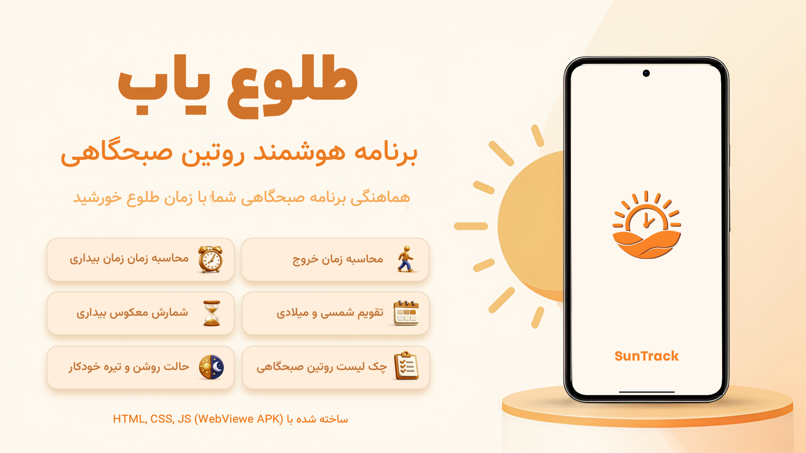
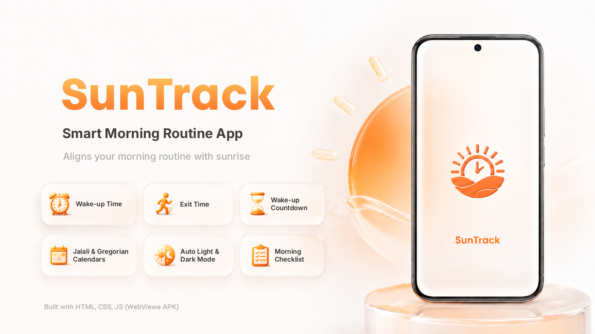

<details name="language" dir="ltr"> 
<summary>  فارسی </summary>

<div dir="rtl">

# طلوع‌یاب | SunTrack

<p>
  
  <a href="https://github.com/MrMR-711/SunTrack/releases"></a>
  <a href="https://github.com/MrMR-711/SunTrack"></a>
  <a href="https://opensource.org/licenses/Apache-2.0"></a>
</p>

<p align="center">
  
</p>

---

##  درباره پروژه

**طلوع‌یاب (SunTrack)** یک اپلیکیشن وب پیشرو (PWA) است که با الهام از علوم ورزشی و فیزیولوژی بدن طراحی شده است. هدف اصلی این برنامه کمک به افرادی است که می‌خواهند صبح‌ها برای پیاده‌روی یا دویدن به بیرون بروند، **زمانی که هوا روشن است اما هنوز گرم نشده**.

###  چرا طلوع‌یاب؟

تحقیقات علمی نشان می‌دهد که ورزش در گرما فشار قلبی-عروقی را به شدت افزایش می‌دهد:

-  ضربان قلب **۵ تا ۱۵ ضربه در دقیقه** بیشتر می‌شود
-  خون به جای عضلات به سمت پوست هدایت می‌شود
-  ذخایر گلیکوژن سریع‌تر مصرف می‌شوند
-  خستگی زودرس و کاهش عملکرد تا **۵۰٪**

در مقابل، ورزش در هوای خنک باعث:
-  بهبود جریان خون به عضلات
-  کاهش خستگی
-  افزایش تا **دو برابری** توان بدنی
-  تجربه ورزشی لذت‌بخش‌تر

طلوع‌یاب با محاسبه دقیق زمان طلوع خورشید برای شهر شما، بهترین لحظه برای شروع فعالیت صبحگاهی را پیدا می‌کند.

---

##  ویژگی‌ها

###  محاسبه هوشمند بر اساس موقعیت

* انتخاب شهر از پایگاه داده جهانی
* پشتیبانی از GPS برای تشخیص خودکار موقعیت
* محاسبه دقیق زمان طلوع برای هر نقطه از جهان

###  زمان‌بندی دقیق

* زمان طلوع خورشید
* زمان خروج (۳۰ دقیقه قبل از طلوع)
* زمان بیداری (۵۵ دقیقه قبل از طلوع)

###  تایم‌لاین معکوس

```text
۰۴:۲۷ ← بیداری و روتین
   ↓
۰۴:۵۲ ← خروج از منزل
   ↓
۰۵:۲۲ ← طلوع خورشید 
```


##  نحوه کار

### فرمول محاسبه

```text
زمان خروج = طلوع خورشید − ۳۰ دقیقه
زمان بیداری = زمان خروج − ۲۵ دقیقه
```

### مثال

فرض کنید طلوع خورشید در تهران ساعت **۰۵:۲۲** باشد.

| مرحله    | زمان  |
| -------- | ----- |
|  طلوع  | ۰۵:۲۲ |
|  خروج  | ۰۴:۵۲ |
|  بیداری | ۰۴:۲۷ |

---

<details>
  <summary style="font-weight: bold; font-size: 1.5em;">
     توضیحات بیشتر
  </summary>

##  معماری پروژه

**طلوع‌یاب (SunTrack)** از ابتدا با این هدف طراحی و توسعه داده شده است که در قالب یک **اپلیکیشن اندروید مبتنی بر WebView** منتشر شود. به همین دلیل، هسته اصلی برنامه به‌صورت **Vanilla HTML، CSS و JavaScript** توسعه یافته و رابط کاربری، منطق برنامه و منابع پروژه همگی در همین بخش قرار دارند.

برای اجرای این هسته روی اندروید، یک پروژه **Android Studio** مبتنی بر **Kotlin** و **Android WebView** استفاده شده است که فایل‌های وب را به‌صورت محلی بارگذاری کرده و آن‌ها را در قالب یک فایل **APK** اجرا می‌کند.

```text
Vanilla HTML / CSS / JavaScript
               │
               ▼
      Android WebView (Kotlin)
               │
               ▼
           Android APK
```

---

##  فناوری‌های استفاده‌شده

### هسته برنامه
- HTML5
- CSS3
- Vanilla JavaScript (ES6)

### لایه اندروید
- Kotlin
- Android WebView
- Android Studio
- Google AI Studio

### سرویس‌های خارجی
- Open-Meteo API
- Nominatim (OpenStreetMap)

---

##  ساختار پروژه

```text
SunTrack/
├── apps/
│   ├── web/              # سورس اصلی برنامه (Vanilla)
│   └── android/          # پروژه Android Studio (WebView)
│
├── docs/                 # مستندات پروژه
├── CHANGELOG.md          # تاریخچه تغییرات
├── LICENSE
└── README.md
```

</details>

---

##  منابع داده

طلوع‌یاب برای دریافت اطلاعات از سرویس‌های زیر استفاده می‌کند:

* **Open-Meteo API** برای زمان طلوع و اطلاعات آب‌وهوا
* **Nominatim (OpenStreetMap)** برای جستجوی شهرها و تبدیل آن‌ها به مختصات جغرافیایی

---

##  مشارکت در پروژه

اگر پیشنهادی برای بهبود برنامه دارید یا با مشکلی روبه‌رو شدید، از طریق **Issues** یا **Pull Requests** در GitHub مشارکت کنید.

از گزارش خطاها، پیشنهاد قابلیت‌های جدید برای توسعه پروژه استقبال می‌شود.

---

##  مجوز

این پروژه تحت مجوز **Apache License 2.0** منتشر شده است.

برای جزئیات بیشتر فایل **LICENSE** را مطالعه کنید.

---

##  ارتباط با سازنده

*  ایمیل: [mohammad117811@gmail.com](mailto:mohammad117811@gmail.com)
*  وب‌سایت: https://mrmr-711.github.io
*  گیتهاب: https://github.com/MrMR-711
*  تلگرام: https://t.me/MrMR_711Channel

---

<p align="center">
ساخته شده با  برای صبح‌هایی بهتر
</p>

</div>
</details>

---

<details open name="language" dir="ltr"> 
<summary>  English </summary>

<div dir="ltr">

# SunTrack

<p>
  
  <a href="https://github.com/MrMR-711/SunTrack/releases"></a>
  <a href="https://github.com/MrMR-711/SunTrack"></a>
  <a href="https://opensource.org/licenses/Apache-2.0"></a>
</p>

<p align="center">
  
</p>

---

##  About the Project

**SunTrack** is a progressive web application (PWA) designed with inspiration from sports science and body physiology. Its primary goal is to help people who want to go out for a walk or run in the morning **when it is bright but not yet hot**.

###  Why SunTrack?

Scientific research shows that exercising in the heat significantly increases cardiovascular strain:

-  Heart rate increases by **5–15 beats per minute**
-  Blood is directed to the skin instead of muscles
-  Glycogen stores are depleted faster
-  Early fatigue and performance drop by up to **50%**

On the other hand, exercising in cool weather:
-  Improves blood flow to muscles
-  Reduces fatigue
-  Increases physical capacity by **up to two times**
-  Provides a more enjoyable exercise experience

By accurately calculating the sunrise time for your city, SunTrack finds the best moment to start your morning activity.

---

##  Features

###  Smart Location-Based Calculation

* Select a city from a global database
* GPS support for automatic location detection
* Accurate sunrise calculation for any point on Earth

###  Precise Timings

* Sunrise time
* Departure time (30 minutes before sunrise)
* Wake-up time (55 minutes before sunrise)

###  Reverse Timeline

```text
04:27 ← Wake-up & routine
   ↓
04:52 ← Leave home
   ↓
05:22 ← Sunrise 
```

---

##  How It Works

### Calculation Formula

```text
Departure time = Sunrise − 30 minutes
Wake-up time = Departure time − 25 minutes
```

### Example

Assume sunrise in Tehran is at **05:22**.

| Step     | Time  |
| -------- | ----- |
|  Sunrise | 05:22 |
|  Departure | 04:52 |
|  Wake-up | 04:27 |

---

<details>
  <summary style="font-weight: bold; font-size: 1.5em;">
     More Details
  </summary>

##  Project Architecture

**SunTrack** has been designed and developed from the start to be released as an **Android application based on WebView**. Therefore, the core of the app is built with **Vanilla HTML, CSS, and JavaScript**, and the user interface, application logic, and project resources are all contained in this core.

To run this core on Android, an **Android Studio** project based on **Kotlin** and **Android WebView** is used to load the web files locally and package them into an **APK** file.

```text
Vanilla HTML / CSS / JavaScript
               │
               ▼
      Android WebView (Kotlin)
               │
               ▼
           Android APK
```

---

##  Technologies Used

### App Core
- HTML5
- CSS3
- Vanilla JavaScript (ES6)

### Android Layer
- Kotlin
- Android WebView
- Android Studio
- Google AI Studio

### External Services
- Open-Meteo API
- Nominatim (OpenStreetMap)

---

##  Project Structure

```text
SunTrack/
├── apps/
│   ├── web/              # Core source (Vanilla)
│   └── android/          # Android Studio project (WebView)
│
├── docs/                 # Documentation
├── CHANGELOG.md          # Changelog
├── LICENSE
└── README.md
```

</details>

---

##  Data Sources

SunTrack uses the following services to retrieve information:

* **Open-Meteo API** for sunrise times and weather data
* **Nominatim (OpenStreetMap)** for city search and geocoding

---

##  Contributing

If you have suggestions for improvement or encounter any issues, please contribute via **Issues** or **Pull Requests** on GitHub.

We welcome bug reports, feature suggestions, and contributions to the project development.

---

##  License

This project is released under the **Apache License 2.0**.

For more details, see the **LICENSE** file.

---

##  Contact the Developer

*  Email: [mohammad117811@gmail.com](mailto:mohammad117811@gmail.com)
*  Website: https://mrmr-711.github.io
*  GitHub: https://github.com/MrMR-711
*  Telegram: https://t.me/MrMR_711Channel

---

<p align="center">
Made with  for better mornings
</p>

</div>

</details>
